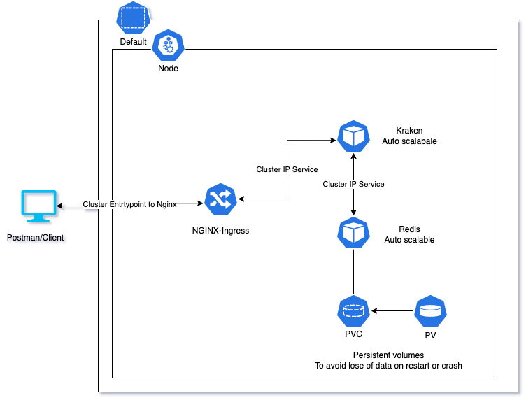
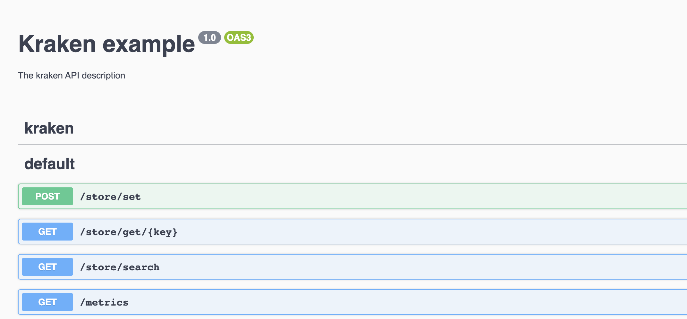

# Welcome to my first Nest.js project

Live @ [http://35.244.39.245](http://35.244.39.245/api/) 
> Uses the CD piepline to update on every merge to `main` branch
## Architecture - K8s
> Redis uses a persistent volume so even on restart or crash, the data will not be lost  

> All deployment are configued in a way that during an update, they won't have any down-time  

  

> Version deployed at GCP does not uses `pvc` due to `billing issues` so to test the same please use `minikube`
## Running the app

```bash
# development - docker
$ docker-compose up dev

# prod - docker
$ docker-compose up prod

# prod - k8s
$ cd k8s && kubectl apply -f .
```
> Docker version will be live @ [http://localhost:5000](http://localhost:5000/api)  

> If using minikube, don't forgot to enable nginx ingress controller using `minikube addons enable ingress`

## API Docs
[/api](http://35.244.39.245/api/) can be used instead of postman to quick test availble API endpoints.


## CI Pipelines

1. [Kraken CI](https://github.com/im-Amitto/lummo/actions/workflows/ci.yaml)  
    - Run jest specs  
    - Keeps track of `Code Coverage`
    - Updates `Test Coverage` tag

2. [Validate Protos](https://github.com/im-Amitto/lummo/actions/workflows/buf-breaking.yml)  
    Checks if there are any breaking changes in the raised PR. Useful to keep track of backward compatibility. ex: [PR#3](https://github.com/im-Amitto/lummo/pull/3/files)

## CD Pipelines

1. [Build and Deploy to GKE](https://github.com/im-Amitto/lummo/actions/workflows/deploy.yml)  
    - Build and upload image to GAR  
    - Updates image for the deployment

> In addition to the attached K8s resources in this Repo, `GCP` also uses an `static-ip` resource in `ingress`

## Metrics
Available at [/metrics](http://35.244.39.245/metrics)  
1. `http_request_duration_ms` : Histogram -> Duration of HTTP requests in ms  
2. `http_response_status_code`: Counter -> Status code of response
3. `entries_in_db`: Counter -> Number of entries added in db
## License
[MIT licensed](LICENSE).